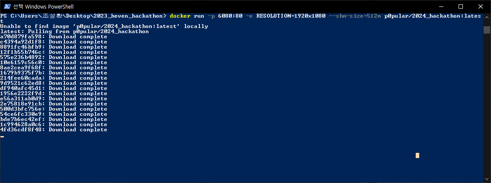
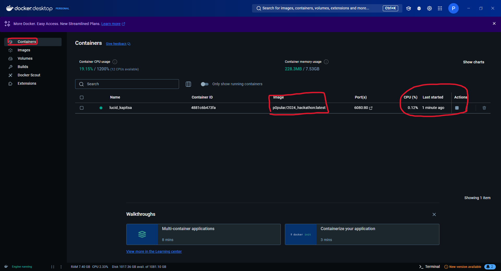
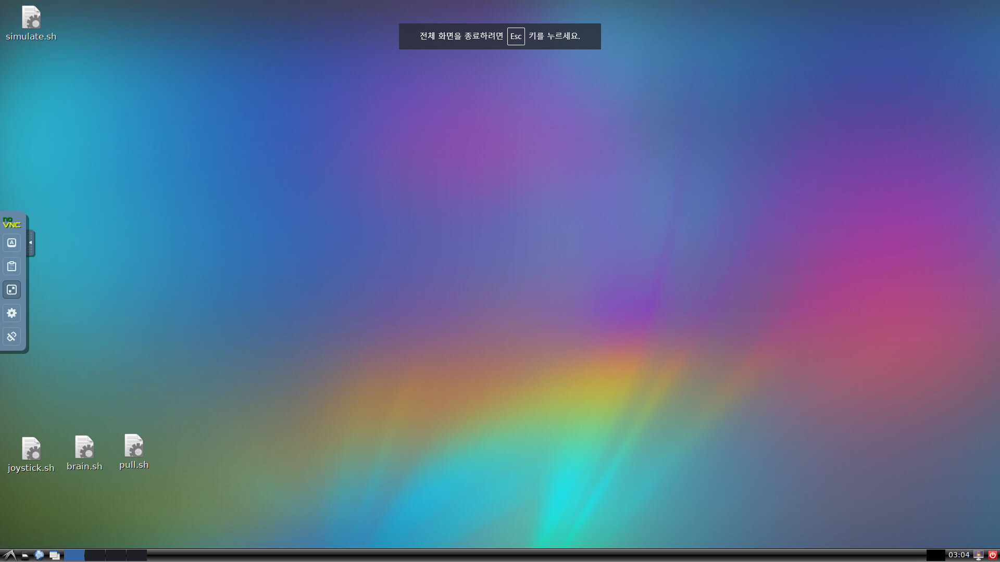
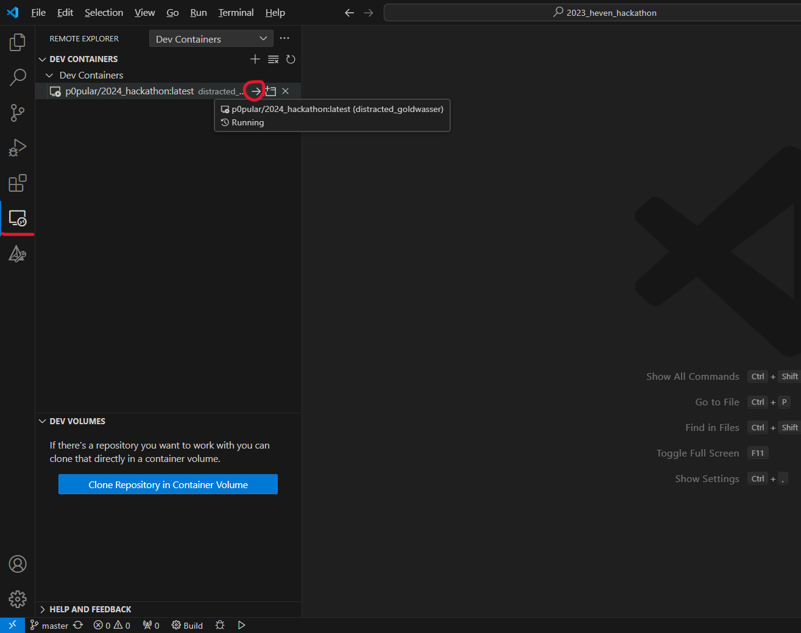
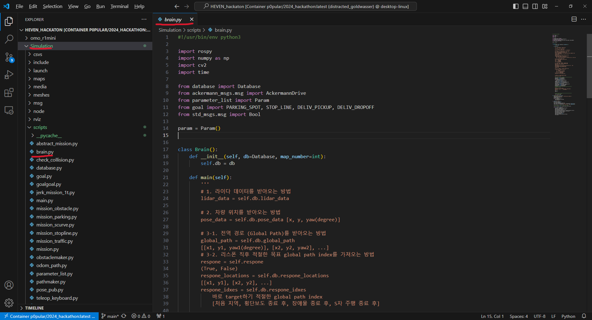

## Docker 환경 구성

#### 1. docker 설치

* 다음의 링크를 참고하여 Docker Desktop [설치](https://docs.docker.com/desktop/install/windows-install/)


해당 파일 다운로드 후, 실행하여 설치 (체크박스 모두 클릭)

설치 완료 후, Docker Desktop 실행하여 다음 화면이 뜨는지 확인


#### 2. 해커톤 시뮬레이터 다운로드

* 윈도우 검색창에서 "Windows Powershell"을 검색하여 실행
* 터미널 창에 다음을 입력
```
docker run -p 6080:80 -e RESOLUTION=1920x1080 --shm-size=512m p0pular/2024_hackathon:latest
```


자동으로 Dockerhub에서 image를 받아 와서 실행함(약 10분 소요).

* 윈도우 검색창에서 "Docker Desktop"을 검색하여 실행



좌측의 "Containers" 버튼 클릭 후, 우측의 "Actions"에 네모 버튼으로 되어있는지 확인 (네모 버튼이어야 도커 컨테이너가 잘 실행중이라는 의미)

만약 실행되고 있지 않으면, 과정 2를 다시 실행.

#### 3. 가상 환경 접속

* 웹 브라우저 (크롬) 을 열고, 다음의 주소로 접속
```
http://127.0.0.1:6080/
```

개발 환경이 설치된 Ubuntu OS를 웹 브라우저에서 이용 가능


#### 4. Visual Studio Code 설치 및 Extension 깔기

* 구글 검색창에 "vscode" 검색하여, 설치


* Extension 설치 후, 프로그램 재실행


좌측 중앙의 "Extensions" 아이콘 클릭 후, "Remote Development" 검색하여 설치


설치 완료 시 위와 같이 뜸. 프로그램 재실행

* 자율주행 알고리즘 코드 접근
1. 왼쪽 옆에 컴퓨터 아이콘(Remote Explorer)을 누름.

    

2. Dev Containers에서 dorowu/ubuntu-desktop-lxde-vnc:focal 옆 화살표를 누름.

    

3. root/ 폴더로 들어가면 해커톤 시뮬레이터 디스크 내에 있는 모든 폴더에 접근할 수 있음

    그 중에서, `catkin_ws/src/HEVEN_hackton/Simulation/scripts/brain.py` 를 수정하면 됨.
  
    

#### 5. 특이사항  
- 인터넷은 chrome 대신 firefox 사용할 것
